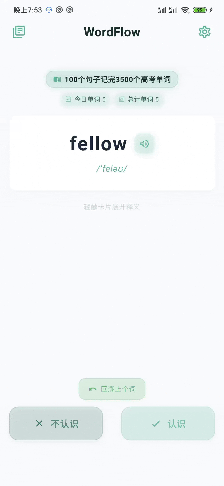
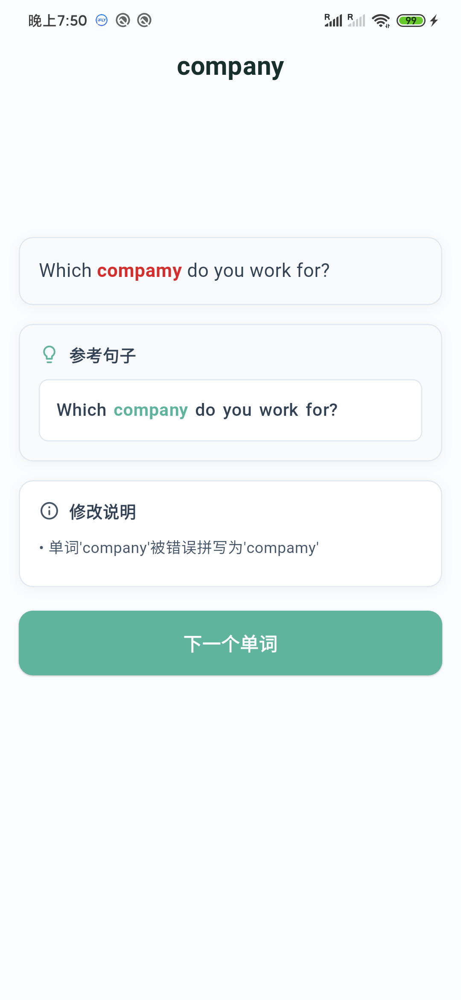
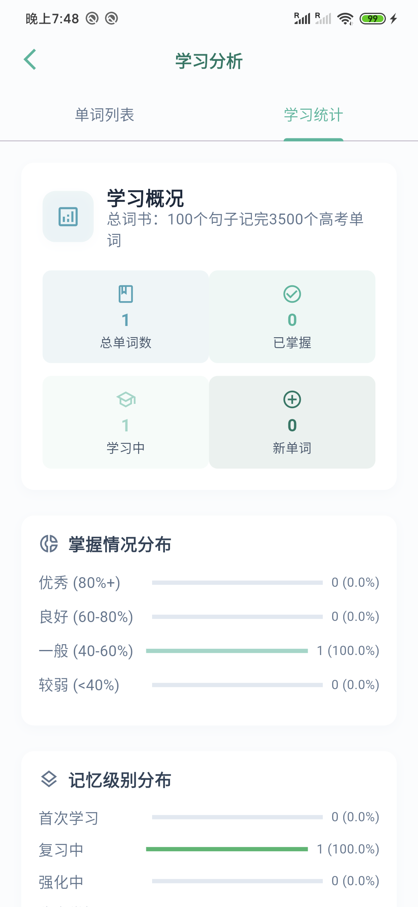
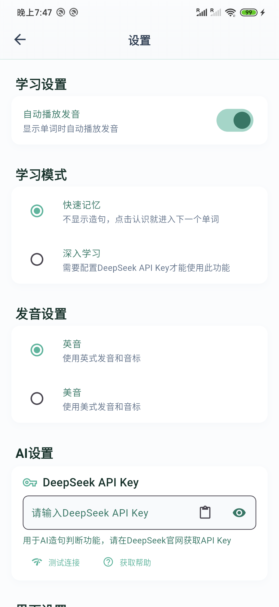

# WordFlow

> Learn vocabulary on your terms with an endless, on-demand stream of words.

一个基于Flutter开发的智能单词学习应用，采用间隔重复算法和AI技术，帮助用户高效记忆英语单词。

## 主要功能

### 智能学习算法
- 支持多种记忆算法：间隔重复、艾宾浩斯遗忘曲线等
- 根据学习表现动态调整复习间隔
- 智能分析单词难度，优化学习路径

### 用户界面
- 字符级动画效果，让文字浮现更生动
- 响应式设计，适配不同屏幕尺寸
- 支持明暗主题切换
- 采用Material Design设计语言

### 词书管理
- 内置多种英语词汇书籍
- 实时跟踪学习进度和状态

### AI智能助手
- 集成DeepSeek API，智能生成例句和释义
- AI评估句子理解能力
- 根据学习水平生成个性化内容

### 学习数据分析
- 可视化图表展示学习进度
- 详细记录学习时间、正确率等数据
- 支持历史数据查看和分析

### 个性化设置
- 自定义学习算法参数
- 丰富的交互音效设置
- 学习数据导入导出功能
- 内置应用更新检测

## 技术栈

- **框架**: Flutter 3.6.0+
- **语言**: Dart
- **状态管理**: Provider + SharedPreferences
- **数据可视化**: fl_chart
- **网络请求**: http + dio
- **本地存储**: shared_preferences + path_provider
- **音频播放**: audioplayers
- **文件处理**: file_picker
- **动画效果**: animated_text_kit

## 支持平台

- ✅ Android
- iOS (开发中)
- Windows (开发中)
- macOS (开发中)
- Web (开发中)

## 安装运行

### 环境要求

- Flutter SDK 3.6.0 或更高版本
- Dart SDK 3.0.0 或更高版本
- Android Studio 或 VS Code
- Git

## 配置说明

### DeepSeek API配置

1. 访问 [DeepSeek平台](https://platform.deepseek.com) 注册账户
2. 获取API Key
3. 在应用设置页面输入API Key
4. 开始使用AI增强功能

## 贡献

欢迎提交Issue和Pull Request来帮助改进项目。

1. Fork 本仓库
2. 创建特性分支 (`git checkout -b feature/AmazingFeature`)
3. 提交更改 (`git commit -m 'Add some AmazingFeature'`)
4. 推送到分支 (`git push origin feature/AmazingFeature`)
5. 开启 Pull Request

## 开源协议

本项目采用 GNU General Public License v3.0 协议，详见 [LICENSE](LICENSE) 文件。

## 致谢

感谢以下项目和服务：
- [Flutter](https://flutter.dev/) - 跨平台UI框架
- [DeepSeek](https://platform.deepseek.com) - AI语言模型服务

如果这个项目对你有帮助，请给个Star支持一下！
